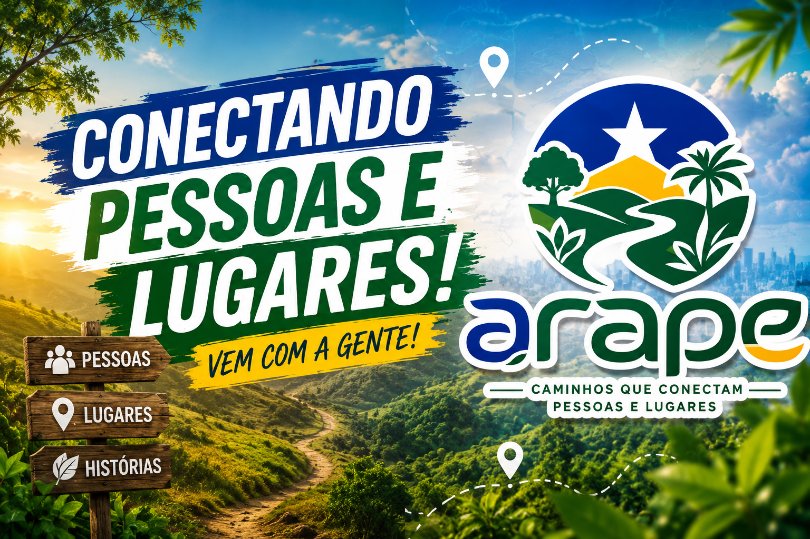

  

<h3 align="center">Caminhos que conectam pessoas e lugares.</h3>

  <strong>Hackathon Extensionista IFRO Ariquemes 2026/1</strong> 
  Categoria: <em>Desafio Livre de Impacto Regional</em> · Turismo Regional / Agroturismo Amazônico

---

🌐 **MVP online:** [arape.vercel.app](https://arape.vercel.app) · acesse no navegador, sem instalação
🎥 **Vídeo de demonstração (item 9.f e 9.k do edital):** <https://youtu.be/VAHbloR9NII>
🎤 **Pitch / apresentação (slides — item 9.g):** [canva.link/7ligvvu7ah3b6g4](https://canva.link/7ligvvu7ah3b6g4)

---

## 👥 Equipe

- **Nome da equipe:** Arape
- **Curso/Turma:** Tecnologia em Análise e Desenvolvimento de Sistemas (ADS) — 5º período
- **Categoria:** Desafio Livre de Impacto Regional
- **Responsável pela equipe:** Filipe Ribeiro Camargo — filiperibeiro.plo@gmail.com

| Integrante | Matrícula |
|---|---|
| Arthur Basseto Trevizan | 2024105100038 |
| Filipe Ribeiro Camargo | 2024105100007 |
| Werley Toledo Serra | 2024105100037 |
| Tana de Souza Rocha | 2024105100009 |

## 🌳 Problema

A Amazônia tem uma das maiores diversidades de experiências turísticas do Brasil — cachoeiras, agroindústrias familiares, trilhas, comunidades originárias, gastronomia regional — mas a maior parte delas é **invisível digitalmente**. O turista que chega a Ariquemes/RO não tem onde descobrir esses lugares, e quem produz/recebe não tem como aparecer.

O resultado é uma economia turística concentrada nos circuitos já consolidados, enquanto pequenos produtores, agroindústrias familiares e povos tradicionais seguem fora do mapa digital — perdendo renda e visibilidade. Do outro lado, o turista que busca experiência autêntica volta pra casa sem saber o que perdeu.

**Público impactado:**
- **Produtores e empreendedores regionais** — sítios cafeeiros, apiários, fazendas de cacau, pesqueiros, restaurantes de comida regional, comunidades originárias.
- **Turistas** — locais, regionais e nacionais que buscam vivências autênticas na Amazônia.
- **Secretarias e órgãos de turismo** — que ganham um mapa vivo da oferta turística do território.

## 💡 Solução

O **Arape** é uma plataforma **mobile-first** (Flutter) que digitaliza a economia das experiências da Amazônia. O usuário abre o app e vê, num mapa interativo, o que sempre esteve ali mas era invisível: cachoeiras, sítios, agroindústrias, trilhas, balneários e aldeias. Cada local tem fotos, descrição, avaliações e contato **direto via WhatsApp** com quem produz.

**Funcionalidades do MVP:**
- 🗺️ **Mapa interativo** (OpenStreetMap) com pins por categoria
- 📚 **Catálogo** com filtros e carrossel de fotos
- 🛣️ **Rotas curadas** com várias paradas, gamificação por selos e XP
- ⭐ **Avaliações** de cada local
- 📱 **Contato direto** com o proprietário/responsável pelo WhatsApp
- 👥 **Aventureiros próximos** no mapa (efeito "Waze")
- 🏆 **Perfil do explorador** com selos conquistados, XP e histórico de visitas

A tese central: **conectar o turista à origem e digitalizar a economia das experiências regionais da Amazônia.**

## 🚀 Como testar

1. Abra **[arape.vercel.app](https://arape.vercel.app)** no navegador (computador ou celular).
2. Na tela inicial, toque em **"Explore a Amazônia"**.
3. No **Mapa** (aba do meio), use os chips de categoria pra filtrar (ex.: "Águas" mostra só cachoeiras e balneários).
4. Toque em qualquer pin (cada pin é a foto de capa do local com o ícone da categoria) → a **tela de detalhe abre direto**.
5. Na tela de detalhe, teste:
   - **"Como chegar"** → tela de navegação tipo Waze
   - **"Falar com proprietário"** → abre o WhatsApp
   - **"Avaliar"** → adiciona uma avaliação na lista
6. Volte ao mapa e toque no botão amarelo **"Rotas sugeridas"** → abra a "Rota das Cachoeiras de Ariquemes" → **"Iniciar rota"** → avance pelas paradas até desbloquear o selo (com animação).
7. Aba **Perfil**: veja métricas, selos (conquistados e bloqueados) e histórico.

> **Não precisa de login.** O protótipo foi desenhado pra que a banca consiga avaliar sem cadastro — basta abrir o link.

## 🛠️ Tecnologias utilizadas

| Camada | Tecnologia |
|---|---|
| **Framework** | Flutter (Dart) — mobile-first com build web |
| **Mapa** | `flutter_map` + tiles OpenStreetMap (sem chave de API) |
| **Geolocalização** | `latlong2` |
| **Estado** | `provider` |
| **Dados** | JSON locais em `assets/data/` (sem backend, sem banco) |
| **Imagens** | `cached_network_image` + `shimmer` (placeholder de carregamento) |
| **Tipografia** | `google_fonts` (Poppins + Inter) |
| **Integração externa** | `url_launcher` (WhatsApp via `wa.me/`) |
| **Ícone e splash** | `flutter_launcher_icons`, `flutter_native_splash` |
| **Hospedagem** | Vercel (build estático do Flutter web) |

## 🤖 Uso de IA

> **Declaração clara (Item 8 do edital):** este projeto foi **desenvolvido com forte apoio de inteligência artificial**, principalmente na **criação do código**. A equipe não esconde esse fato — ao contrário, considera-o uma vantagem **desde que combinado com uma metodologia rigorosa**. É exatamente o que aplicamos.

**Ferramenta utilizada:** Claude (Anthropic, modelo Opus 4.7), via Claude Code CLI.

### 🧭 Metodologia adotada: **Spec-Driven Development (SDD)**

A equipe **não usou IA "no improviso"**. Aplicamos *Desenvolvimento Orientado por Especificação* — abordagem em que **toda a estratégia, escopo e identidade do produto são definidos pela equipe ANTES de qualquer linha de código ser escrita**. A IA entra como executora qualificada de uma especificação que a equipe redigiu, revisou e mantém sob sua responsabilidade técnica.

**Como o SDD foi aplicado no Arape:**

1. **Spec inicial completa, escrita pela equipe.** Antes do desenvolvimento começar, a equipe redigiu uma especificação detalhada cobrindo: público-alvo, problema, telas, modelos de dados (formato dos JSONs), paleta de cores (com referência à bandeira de Rondônia / logo oficial), navegação, regras de negócio, gamificação (selos, XP, rotas), critérios de "pronto", stack técnica e estrutura de pastas. Essa spec foi **o único contrato** entre a equipe e a IA assistente.
2. **Geração orientada.** A IA gerou código *exclusivamente a partir da spec*. A cada etapa, a saída foi conferida contra a especificação — desvios foram corrigidos pela equipe.
3. **Revisão, correção e iteração.** A equipe revisou cada arquivo gerado. Quando a IA errou (ex.: chutou cores do logo em vez de amostrar dos pixels), a equipe identificou e corrigiu. Quando a IA não conhecia o contexto local (descrições dos locais, menção respeitosa à Aldeia Karipuna), a equipe definiu o conteúdo.
4. **Validação externa.** Apresentação do MVP no Rondônia Rural Show, com endosso da SETUR-RO (ver seção *Validação*).

**Por que isso é importante para a banca:** o edital (Item 8) determina que *"o uso de IA não dispense a equipe de compreender, apresentar, testar, documentar e defender tecnicamente a solução."* O SDD é justamente a forma profissional de cumprir essa exigência — a equipe se torna **arquiteta** da solução; a IA executa o que foi especificado. Isso preserva domínio técnico, autoria intelectual e qualidade do produto.

### Partes do projeto apoiadas por IA
- **Criação do código** (principal apoio): widgets, telas, navegação, animação de conquista do selo, modelos de dados, serviços de carga dos JSONs, gerenciamento de estado com Provider.
- **Configuração de assets a partir do logo oficial**: crops automáticos do emblema e do wordmark, geração de versões transparente e monocromática branca via script Python.
- **Amostragem de pixels** do logo para travar a paleta exata: verde `#005030`, azul `#003084`, amarelo `#F0C000`.
- **Estruturação do plano de testes** (Campo 3 do roteiro da disciplina) e dos 9 widget tests em `test/`.
- **Redação técnica** deste README, do roteiro de Teste de Software e da seção de Segurança da Informação.
- **Configuração do deploy** na Vercel (`vercel.json` + `.vercelignore`).

### O que a equipe definiu, revisou e validou
- **Conceito, público-alvo, proposta de valor e tese** — decisão da equipe, baseada em conhecimento da região amazônica.
- **A spec inicial** que orientou todo o desenvolvimento — escrita integralmente pela equipe.
- **Conteúdo cultural** — escolha dos 12 locais fictícios de demonstração ambientados em Ariquemes, descrições, e abordagem respeitosa à comunidade originária Karipuna.
- **Decisões de UX, gamificação e fluxo** — quais selos existem, quais rotas curadas, como funciona a animação de conquista.
- **Validação externa** com a SETUR-RO no Rondônia Rural Show.
- **Cada arquivo gerado** foi conferido antes de ser comitado no repositório.
- **Integração com Teste de Software e Segurança da Informação** — estratégias decididas pela equipe (ex.: privacidade por design, três níveis de oráculo).
- **Defesa técnica completa** — a equipe domina e explica cada decisão arquitetural do produto.

### Cuidados éticos
- **Nenhum dado pessoal, credencial, chave de API ou informação sensível** foi enviado a ferramentas externas de IA durante o desenvolvimento.
- Toda a saída foi revisada e validada pela equipe antes de ser incorporada ao projeto.

## ✅ Validação — impacto extensionista

### Apresentação institucional no Rondônia Rural Show

A equipe Arape apresentou o projeto durante o **Rondônia Rural Show de [DATA — preencher]**, um dos maiores eventos do agronegócio do estado, que reúne produtores rurais, empreendedores, gestores públicos e o setor agropecuário regional.

**Principal feedback institucional:**
O **Superintendente da SETUR-RO** (Secretaria de Estado do Turismo de Rondônia) acompanhou a apresentação e **endossou a proposta**, demonstrando interesse pela ideia de digitalizar e dar visibilidade ao agroturismo regional. O endosso, vindo do **órgão responsável pela política estadual de turismo**, reforça a aderência do projeto às prioridades de turismo da Amazônia.

Esse momento valida três coisas:
1. O **problema escolhido** (invisibilidade digital do agroturismo regional) é real e reconhecido pelo poder público.
2. A **categoria escolhida** (Desafio Livre de Impacto Regional) tem aderência total ao Arape.
3. Existe **espaço institucional** para continuidade da proposta após a hackathon, em diálogo com a SETUR-RO.

> 📷 *Foto da apresentação no Rondônia Rural Show: [adicionar em `docs/validacao_rural_show.jpg`]*

### Testes técnicos

Os testes automatizados estão na pasta `test/` (rodam com `flutter test`). Veja detalhes na próxima seção.

## 🧪 Testes e validação (disciplina Teste de Software)

Aplicamos os fundamentos de Teste de Software (BSTQB, 2023, Cap. 6) ao MVP. Definimos o conceito de **funcionar corretamente** e construímos casos que provam isso.

### Oráculo (em três níveis)

1. **Identidade de dados** — cada local exibido bate exatamente com `assets/data/locais.json`.
2. **Consistência de regras** — filtros, conclusão de rota e desbloqueio de selo seguem as regras definidas em `rotas.json` e `categorias.json`.
3. **Fluxo de contato consistente** — o botão "Falar com proprietário" abre o WhatsApp para o número cadastrado no JSON daquele local (números são placeholders neste protótipo; em produção seriam os reais dos proprietários cadastrados).

### Abordagem combinada (3 técnicas)

- **Casos por exemplo** automatizados em `test/` (rodam com `flutter test`).
- **Propriedades / invariantes**: *"o conjunto filtrado é sempre subconjunto do total"*; *"o nº de selos conquistados nunca diminui"*; *"concluir a rota X só desbloqueia o selo cujo nome bate com `rota.seloRecompensa`"*.
- **Validação com usuário real** — endosso institucional da SETUR-RO no Rondônia Rural Show (acima).

### Plano mínimo de teste (Campo 3 do roteiro do AVA)

| Funcionalidade | Oráculo | Caminho feliz | Erro / borda | Evidência |
|---|---|---|---|---|
| **Filtro por categoria** (Mapa e Catálogo) | Lista exibida é `{l ∈ locais : l.categoria == id}`; "Todos" retorna os 12 locais | Toca "Águas" → 3 pins (Cachoeira do Monte Negro, Balneário Rio Jamari, Pesqueiro Águas Claras) | Toca "Todos" depois de filtrar → volta aos 12; alternar chips não gera lista vazia indevida | Widget test em `test/` + GIF |
| **Conclusão de rota com desbloqueio do selo** | Concluir todas as paradas desbloqueia *exatamente* `rota.seloRecompensa` e soma `rota.xpRecompensa`; abandono não desbloqueia | "Rota das Cachoeiras" + "Cheguei" 3 vezes → animação de conquista, `rotasCompletas` +1, `xp` +150, selo "Caçador de Cachoeiras" conquistado | Iniciar a rota e voltar antes da última parada → o selo continua bloqueado | Teste de `AppState.concluirRota()` + screenshot da animação |
| **Avaliar local em memória** | Nova avaliação vira o **1º item** da lista da tela de detalhe, autor "Você" | 5 estrelas + "Lindo demais!" → aparece no topo, antes da "Marina S." | Comentário em branco → guarda com "Avaliação sem comentário."; seletor não permite 0 estrelas | Widget test acionando `StarSelector` + `TextField` + GIF |

> 📸 *Output de `flutter test` (todos verdes): [adicionar em `docs/testes_output.png`]*

## 🔒 Segurança da Informação (privacidade por design)

> Disciplina de **Segurança da Informação** integrada ao projeto. O Arape foi desenhado seguindo o princípio de **privacidade por design**: *se o dado não é necessário para o funcionamento do MVP, ele não é coletado*. Essa postura é coerente com a natureza do app (descoberta turística) e elimina superfícies de ataque desde a concepção.

### Postura de segurança adotada

- **Sem autenticação / sem login.** O Arape é um aplicativo de **descoberta**, não de cadastro. Qualquer pessoa abre e explora. **Justificativa técnica:** o protótipo não armazena PII, não tem backend nem banco, e não troca dados sensíveis. Sem ativo de risco, autenticação é uma superfície de ataque desnecessária (princípio do menor privilégio aplicado ao próprio escopo).
- **Sem coleta de dados.** Nenhuma solicitação de e-mail, telefone, CPF, localização persistente ou foto. Avaliações e contadores ficam em memória e zeram ao fechar o app.
- **Sem segredos no repositório.** Não há chaves de API, tokens ou credenciais — porque não há serviços pagos integrados (o OpenStreetMap dispensa chave; o WhatsApp usa link público `wa.me/`).
- **HTTPS em todas as comunicações.** Deploy Vercel entrega HTTPS por padrão; imagens externas (Unsplash) via HTTPS; link de WhatsApp HTTPS.

### Análise do OWASP Top 10 aplicada ao Arape

| Risco OWASP | Aplica? | Postura adotada |
|---|---|---|
| **A01** Quebra de controle de acesso | ❌ Não aplicável | Sem controle de acesso porque não há recurso restrito |
| **A02** Falhas criptográficas | ❌ Não aplicável | Não armazena/transmite dados sensíveis |
| **A03** Injeção (SQL / NoSQL) | ❌ Não aplicável | Sem banco; dados são JSONs estáticos no bundle |
| **A04** Projeto inseguro | ✅ Aplicado | **Privacidade por design**; sem coleta; sem PII |
| **A05** Configuração insegura | ✅ Aplicado | Headers padrão seguros do Vercel; HTTPS forçado |
| **A06** Componentes vulneráveis | ✅ Mitigado | **Dependabot ativado** no repositório; dependências do `pubspec.yaml` revisadas |
| **A07** Falhas de autenticação | ❌ Não aplicável | Sem autenticação por escolha consciente de projeto |
| **A08** Falhas de integridade | ✅ Mitigado | Build do Flutter versionado; deploy reproduzível na Vercel |
| **A09** Falhas de log / monitoramento | ⚠️ Parcial | Logs nativos da Vercel + console do navegador (suficiente para um MVP) |
| **A10** SSRF | ❌ Não aplicável | Sem requisições server-side; tudo é client-side |

### Ferramentas de verificação utilizadas
- **GitHub Secret Scanning** — ativado, varre o repositório procurando segredos vazados.
- **Dependabot** — ativado, varre `pubspec.lock` por dependências vulneráveis.
- **Headers de segurança HTTPS / HSTS** — herdados da configuração padrão da Vercel.

### Limitações conhecidas (e o caminho pra V2)
Em uma evolução com backend, surge a necessidade de:
- Autenticação (e aí entram bcrypt/Argon2 para hash de senha)
- Controle de acesso por perfil (turista / proprietário / admin)
- Validação server-side e sanitização de entradas
- Logs de auditoria e monitoramento contínuo
- Endereçamento completo do OWASP Top 10

Quando essa evolução ocorrer, o projeto já tem o **enquadramento conceitual** mapeado nesta seção, bastando aplicá-lo às novas superfícies criadas.

## 🎬 Vídeo de demonstração

🔗 **Vídeo:** <https://youtu.be/VAHbloR9NII>
🔗 **Slides do pitch:** [canva.link/7ligvvu7ah3b6g4](https://canva.link/7ligvvu7ah3b6g4)

Conteúdo do vídeo (item 9.k do edital):
- Demonstração completa do MVP (Boas-vindas → Mapa → Detalhe → Rota → Conquista do selo → Perfil)
- Tecnologias utilizadas
- Declaração de uso de IA (Claude / Anthropic) e revisão pela equipe
- O que funciona hoje e o que ainda não funciona (v2)

## 📊 O que funciona

- Tela de Boas-vindas com logo e tagline oficial
- Mapa interativo com 12 locais fictícios de demonstração ambientados em Ariquemes/RO, filtros por categoria, avatares de aventureiros próximos
- Catálogo com carrossel de fotos e mesmos filtros
- Detalhe do local com galeria, selo "Verificado", produtos (rastreabilidade), avaliações com resposta do proprietário, e três botões de ação ("Como chegar", "Falar com proprietário" via WhatsApp, "Avaliar")
- 3 rotas curadas (Rota das Cachoeiras, Rota do Café e da Castanha, Rota Cultural e Sabores)
- Navegação tipo Waze com `Polyline`, distância e tempo, botão "Cheguei" que registra a visita
- Animação de conquista do selo ao concluir uma rota multi-paradas (XP + selo desbloqueado)
- Perfil com métricas, grid de selos (conquistados/bloqueados) e histórico
- Build Web publicado na Vercel (acesso direto pela URL no topo do README)
- Ícone do app e splash screen com o logo oficial

## 🔭 O que ainda pode melhorar (v2)

- **Backend real** (Supabase ou Firebase) para persistir avaliações, visitas e selos entre sessões e dispositivos
- **Cadastro de proprietários** com painel administrativo (e aí entram autenticação, autorização e OWASP Top 10 completo)
- **Geolocalização real** do usuário (hoje "você" é uma coordenada mockada em Ariquemes)
- **Pagamento integrado** para reserva direta de experiências
- **Distribuição em lojas** (Google Play e App Store) — hoje o MVP roda no navegador via Vercel
- **Curadoria expandida** dos locais com fotos próprias (hoje uso Unsplash como demonstração)

## 📄 Licença

Código liberado sob a **licença MIT** para fins acadêmicos e de demonstração no contexto da Hackathon Extensionista IFRO Ariquemes 2026/1. As imagens demonstrativas são do Unsplash (uso livre). O **logo Arape** é propriedade da equipe.

---

<em>Hackathon Extensionista IFRO Ariquemes 2026/1 "Transformando problemas reais em soluções reais."</em>

